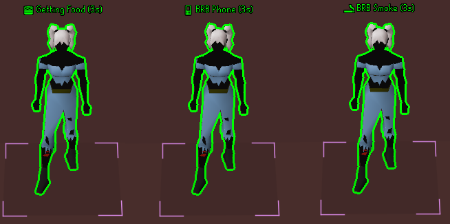
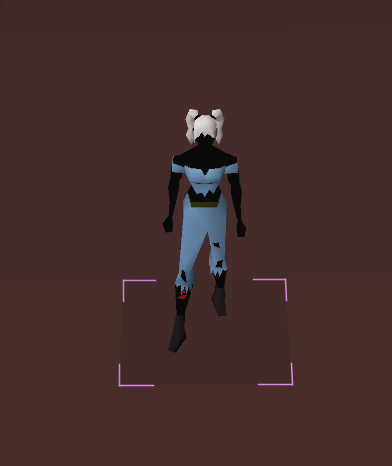
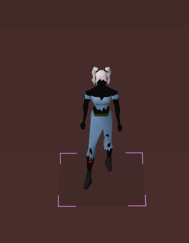

# Away Status

A RuneLite plugin that displays AFK status above players when they type keywords like `brb`, `afk`, or time-based messages like `2mins`. Perfect for coordinating group activities like raids, where you need to know if someone is away from their keyboard.

## Features

- **Automatic Status Detection**: Detects when players type `brb`, `afk`, or time-based messages (e.g., `brb 5mins`, `afk 2min`)
- **Visual Indicators**: Displays status text above player characters with customizable fonts, colors, and positions
- **Countdown Timers**: Shows countdown for time-based AFK messages (e.g., "BRB 5 mins (4m 30s)")
- **Elapsed Time Tracking**: For indefinite AFK statuses, displays how long the player has been away (e.g., "BRB (2m 15s)")
- **Player Highlighting**: Highlight AFK players with customizable colors and highlight types (Tile, Glow, Outline)
- **Custom Keywords**: Create custom keywords with personalized status messages and icons
- **Minimap Indicators**: Optional minimap indicators to spot AFK players at a glance
- **Friends/Clan Priority**: Highlight friends and clan members with different colors
- **Auto-Removal**: Automatically remove AFK status when players type `back` or move
- **Statistics Tracking**: Tracks AFK statistics for all players

## Screenshots

### Custom Messages
Custom keywords allow you to create personalized status messages with icons. These can be configured in the plugin settings.



### Indefinite AFK (Counting Up)
When a player types `brb` or `afk` without a time, the plugin tracks how long they've been away and displays an increasing timer.



### Time-Based AFK (Countdown)
When a player specifies a time (e.g., `brb 5mins`), the plugin shows a countdown timer. After the timer expires, it displays how late they are (e.g., "BRB 5 mins (2m 15s late)").



## Usage

### Basic Keywords
Simply type any of these keywords in public chat, private messages, friends chat, or clan chat:
- `brb` - Sets status to "BRB" (indefinite, counts up)
- `afk` - Sets status to "AFK" (indefinite, counts up)
- `brb 5mins` - Sets status to "BRB 5 mins" with countdown
- `afk 2min` - Sets status to "AFK 2 min" with countdown
- `back` - Removes your AFK status

### Custom Keywords
You can create custom keywords in the plugin settings using the format:
```
keyword:status:icon
```

For example:
- `coffee:Getting Coffee:☕`
- `work:At Work:💼`
- `food:Getting Food:🍔`

Multiple keywords can be added by separating them with commas:
```
coffee:Getting Coffee:☕,work:At Work:💼,food:Getting Food:🍔
```

### Default Custom Keywords
The plugin includes several hardcoded default keywords that work out of the box:
- `brb toilet`, `brb bathroom`, `brb piss` → "BRB Toilet" 🚽
- `brb food`, `brb eating`, `gonna eat` → "Getting Food" 🍔
- `brb coffee`, `gonna get coffee` → "Getting Coffee" ☕
- `brb smoke`, `brb smoking`, `gonna smoke` → "BRB Smoke" 🚬
- `brb shower`, `gonna shower` → "BRB Shower" 🚿
- `brb phone`, `phone call`, `brb call` → "BRB Phone" 📱

## How It Works

1. **Detection**: The plugin monitors chat messages for keywords in public chat, private messages, friends chat, and clan chat
2. **Status Display**: When a keyword is detected, the player's status is displayed above their character
3. **Timer Management**: 
   - For time-based messages, a countdown is shown
   - For indefinite messages, elapsed time is tracked and displayed
   - After timers expire, "late" time is displayed instead
4. **Auto-Removal**: Status is automatically removed when:
   - Player types `back`
   - Player moves to a different tile
   - Auto-remove timeout is reached (if enabled)
